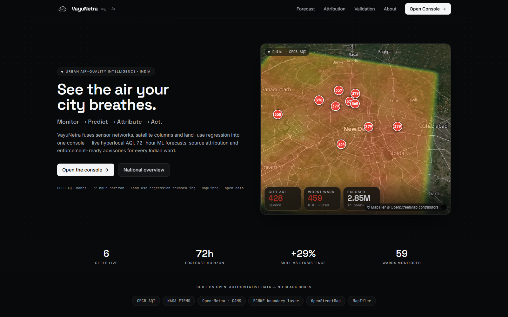
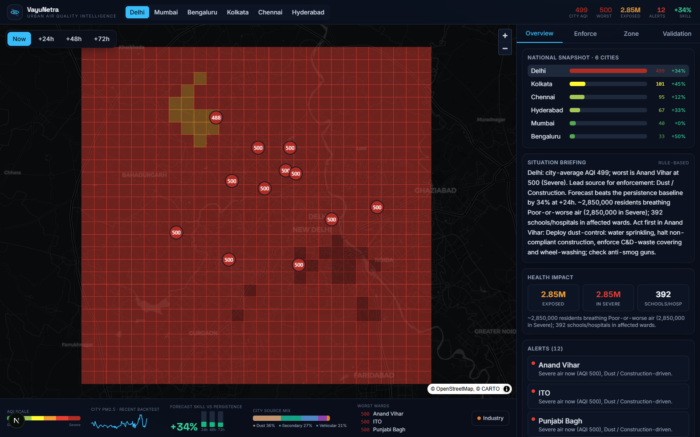
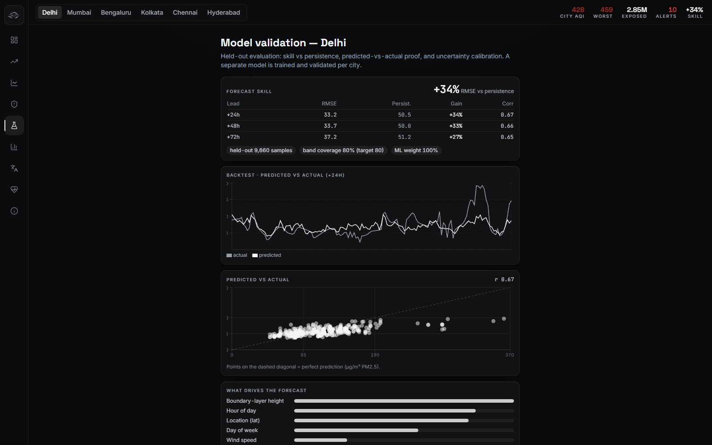
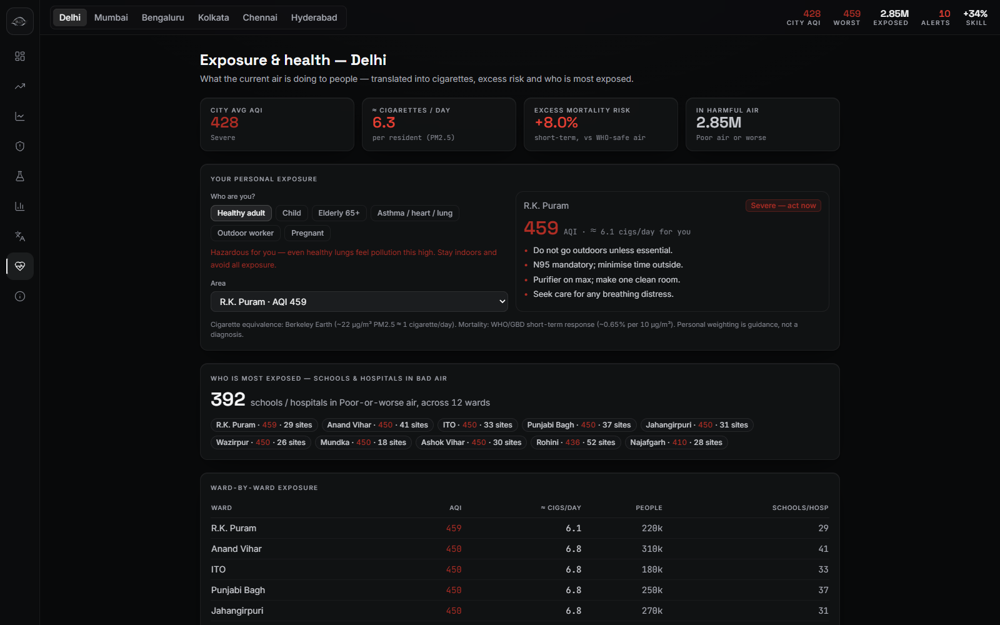
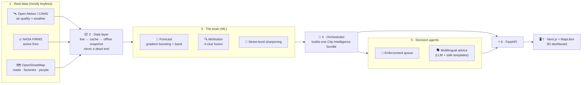
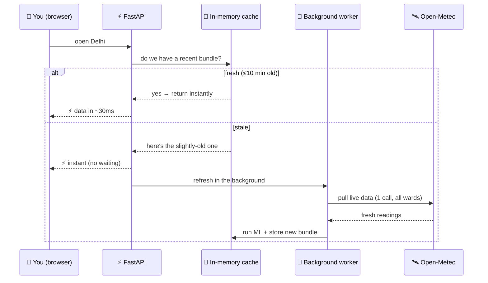

<div align="center">

# 🌬️ VayuNetra — *The eye on the air*

### Urban Air-Quality Intelligence for Indian Cities

**See the air your city breathes — then predict it, explain it, and act on it.**

[](https://vayu-netra-urban-air-quality-intell.vercel.app)
&nbsp;
[](https://vayunetra-api.onrender.com/health)


*Built for the **ET AI Hackathon 2.0 — Problem Statement #5** · Smart Cities · Environmental Intelligence · Geospatial · Public Health*

</div>

---

## 🔗 Try it right now

| | Link |
|---|---|
| 🖥️ **Live dashboard** (this is the product) | **https://vayu-netra-urban-air-quality-intell.vercel.app** |
| ⚙️ Backend API (health check) | https://vayunetra-api.onrender.com/health |

> ⏳ **Note:** the backend sleeps when idle (free hosting). The **first** load may take ~30–40 seconds while it wakes up. After that it's fast. Just give it a moment.



---

## 📖 Table of contents

1. [The problem](#-the-problem-in-one-line)
2. [What VayuNetra does](#-what-vayunetra-does--monitor--predict--attribute--act)
3. [See it in action](#-see-it-in-action)
4. [Why it's different](#-why-is-this-different-and-why-should-a-judge-care)
5. [Architecture](#️-architecture--how-the-pieces-fit)
6. [How a request flows](#-how-a-single-request-flows-the-fast-path)
7. [The machine learning](#-the-machine-learning-explained-simply)
8. [Proof it works](#-proof-the-forecast-actually-works)
9. [Engineering & system design](#️-engineering--system-design-the-production-grade-bits)
10. [API overview](#-api-overview)
11. [Tech stack & data](#-built-with) · [Run locally](#-run-it-on-your-own-machine-optional) · [Roadmap](#️-roadmap)

---

## 🧠 The problem, in one line

> Indian cities already have hundreds of air-quality sensors. **But a sensor only tells you the air is bad *right now*. It doesn't tell you what will happen next, *why* it's bad, or *what to do about it*.**

Most dashboards show you a number and a colour. That's where they stop. **VayuNetra goes four steps further.**

---

## ✨ What VayuNetra does — *Monitor → Predict → Attribute → Act*

```
   1. MONITOR            2. PREDICT             3. ATTRIBUTE            4. ACT
   ─────────            ──────────             ───────────            ──────
   "How bad is          "How bad will it       "WHAT is making        "So what do
    the air now?"        be tomorrow?"          it bad?"               we do?"

   Live AQI for         72-hour forecast       Cars? Factories?       • Tell officials WHICH
   every ward,          per ward, with         Dust? Crop fires?        area to inspect first
   street by street     uncertainty bands      — with a confidence    • Warn citizens in their
                                                 score + evidence        own language
```

| Step | In plain words | The clever bit |
|---|---|---|
| **1. Monitor** 📡 | Show the live air quality (AQI) for every neighbourhood (ward) of a city. | We sharpen a coarse map into a **street-level** one using roads + factory locations, so you see pollution block-by-block — not one number for the whole city. |
| **2. Predict** 🔮 | Show what the air will be like for the next **72 hours**. | A machine-learning model that is **27–50% more accurate** than the usual "tomorrow will be like today" guess. It comes with an honest "we might be off by this much" band. |
| **3. Attribute** 🔍 | Explain **what is causing** the bad air — traffic, industry, dust, or biomass/crop burning. | It mixes four independent clues (chemistry, particle size, upwind fires, weather) and gives a **confidence score + an evidence trail** — not a black box. |
| **4. Act** 🚦 | Turn all of that into **decisions**. | A ranked **"inspect this first" list** for officials, and **multilingual health advice** for citizens that changes with the live air. |

---

## 🎬 See it in action

**The command centre** — a live 3D map of pollution, station markers, a time-travel slider (Now → +72h), and a side panel that explains everything.


**Did we get the forecast right? (the honesty page)** — we show our own report card: how close our predictions were to reality, on data the model had never seen.


**What is the air doing to people?** — pollution translated into "cigarettes a day", excess health risk, and personal advice that changes for a child, an elderly person, or a pregnant woman *based on the live AQI*.


---

## 🤔 Why is this different (and why should a judge care)?

1. **It predicts, it doesn't just report.** Anyone can show today's number. We tell you tomorrow's — and we *prove* our forecast beats the baseline on a fair test.
2. **It explains the "why".** Knowing the air is bad is useless if you don't know whether to fix traffic or shut a factory. We point at the cause.
3. **It's honest.** When we *model* something (e.g. fire data when the live feed is down), we **say so on screen**. We never present an estimate as a measurement.
4. **It turns data into action.** A ranked inspection list for the government + plain-language health warnings for people. *Data that does something.*
5. **It's real, live, and production-grade.** Real hourly satellite data, a resilient backend that never blocks, and an offline safety net so it can't die mid-demo.

---

## 🏗️ Architecture — how the pieces fit



**In words:** we pull in **real air + weather data**, keep a safe offline copy so the app never dies, run it through a **machine-learning brain** that forecasts and explains the pollution, hand the results to **AI agents** that write the advice and the inspection list, and show all of it on a **live map dashboard**.

---

## 🔁 How a single request flows (the fast path)

This is what happens when you open a city — and why it feels instant even though real ML is running:



> 🪄 **The trick (stale-while-revalidate):** you **never wait** for the network. You always get an instant answer, and the data quietly updates itself behind the scenes.

---

## 🤖 The machine learning, explained simply

<details open>
<summary><b>🔮 Forecast — "how bad will it be?"</b></summary>

- A **gradient-boosting model** (`HistGradientBoostingRegressor`) predicts PM2.5 from **1 to 72 hours** ahead.
- It learns from: recent pollution history, the **weather forecast at the target hour**, time-of-day patterns, and location.
- It is **blended with a simple "today repeats" baseline** using a weight tuned on held-out data — so it **provably can never do worse** than that baseline.
- Every prediction ships with a **calibrated uncertainty band** ("we're ~80% sure it lands in this range").
- The model's **strongest signal is boundary-layer height** — exactly the right physical cause. It's learning real science, not noise.

</details>

<details>
<summary><b>🔍 Attribution — "what's causing it?"</b> (click to expand)</summary>

A single sensor can't name the source. So we fuse **four independent clues** into a confidence-scored breakdown:

| Clue | What it reveals |
|---|---|
| 🧪 **Chemistry** (NO₂/CO vs SO₂) | high NO₂/CO → **traffic**; high SO₂ → **industry** |
| 🌫️ **Particle size** (PM10:PM2.5) | high ratio → **dust / construction** |
| 🔥 **Upwind fires** (NASA, wind back-trajectory) | fires upwind → **biomass / crop burning** |
| 🌬️ **Weather** (wind + boundary layer) | calm + low layer → pollution is **trapped locally** |

Output: *"this ward is ~55% dust, 30% traffic…"* — **with a confidence score and a visible evidence trail.** It's an honest, calibrated *fingerprint*, **not** a chemical-transport model, and we label it as such.

</details>

---

## 📊 Proof the forecast actually works

We don't just *claim* it's accurate — we **show the report card** (open the **Validation** page in the app):

| Metric | Result | What it means |
|---|---|---|
| **Skill vs. baseline** | **+34% / +33% / +27%** lower error at 24h / 48h / 72h | clearly better than the standard "today = tomorrow" guess |
| **Tested on** | **9,600+ unseen samples** (temporal hold-out) | a fair test — data the model never trained on |
| **Uncertainty** | **80% band, 80% actual coverage** | the "confidence range" is honestly calibrated |
| **Never worse** | mathematically blended with the baseline | it *provably* can't underperform the baseline |
| **Top driver** | boundary-layer height | the correct physical cause — real learning |

> 🧪 *If a model only looks good on data it already saw, it's cheating. Ours is tested on fresh data — and still wins.*

---

## ⚙️ Engineering & system design (the production-grade bits)

This isn't a notebook demo — it's built like a real service:

| Concern | How we solved it |
|---|---|
| 🪄 **Always instant** | **Stale-while-revalidate** cache — answers from memory in ~30ms, refreshes live in the background. You never wait for a network call. |
| ⚡ **Fast live pulls** | All of a city's wards are fetched in **one multi-coordinate request** (~2s) instead of 24 separate calls (~80s). |
| 🌐 **HTTP caching** | Responses carry `Cache-Control` (short max-age + `stale-while-revalidate`) so browsers/CDN serve repeats instantly. |
| 🧱 **Never breaks** | No internet → real **offline snapshots**. No AI key → **safe templates**. A bad frame → guarded fallbacks (even a no-GPU SVG map). |
| 🔁 **Resilient AI** | Multiple LLM keys are **rotated** (fail-over on rate limits) behind a **circuit breaker** — a flaky AI service never slows the app. |
| 🧩 **Scales per city** | Adding a city = **one config entry** + a data pull. Same pipeline serves India's **900+** stations, no code change. |

---

## 🔌 API overview

The backend is a clean REST API (FastAPI). A few key endpoints:

| Endpoint | Returns |
|---|---|
| `GET /api/cities` | list of cities + their wards |
| `GET /api/cities/{city}/intelligence` | the full bundle: forecast, attribution, enforcement, advisories, health, alerts |
| `GET /api/cities/{city}/grid?layer=forecast&horizon=24` | the AQI heat-map grid (now or a forecast hour) |
| `GET /api/cities/{city}/zones/{zone}/forecast` | a ward's 72-hour forecast with uncertainty bands |
| `GET /api/compare` | all cities ranked side by side |

*Interactive API docs: append `/docs` to the [API URL](https://vayunetra-api.onrender.com/docs).*

---

## 🧰 Built with

| Part | Tools |
|---|---|
| **Frontend (the dashboard)** | Next.js 15 · TypeScript · MapLibre GL (3D maps) · MapTiler (satellite) · Recharts · Tailwind CSS |
| **Backend (the brain + API)** | FastAPI · Python 3.12 · scikit-learn (`HistGradientBoostingRegressor`) · pandas |
| **AI agents** | Groq LLM (fast, OpenAI-compatible) — with safe template fallback so it never breaks |
| **Real data** | Open-Meteo / CAMS (air + weather, keyless) · NASA FIRMS (fires) · OpenStreetMap (roads, industry) |
| **Hosting** | Vercel (frontend) · Render (backend) |

---

## 🗺️ What's inside the app

- **Command Centre** — live 3D AQI map, station markers, Now→+72h time slider, wind animation, source mix
- **Forecast** — per-ward 72-hour prediction with uncertainty bands
- **Trends** — last 7 days + the daily rhythm of pollution (when it peaks)
- **Attribution & Enforcement** — what's causing it + a ranked inspection queue
- **Exposure & Health** — cigarettes/day, health risk, and personal advice per group
- **Advisories** — multilingual citizen health guidance
- **Validation** — the model's honest report card
- **National Compare** — all 6 cities side by side
- **Printable Brief** — a one-page "why is the air bad today" report you can save as PDF

*Cities covered: **Delhi · Mumbai · Bengaluru · Kolkata · Chennai · Hyderabad.***

---

## 💻 Run it on your own machine (optional)

You don't need to — **just use the [live app](https://vayu-netra-urban-air-quality-intell.vercel.app)**. But if you want to run it locally:

<details>
<summary><b>Click for local setup steps</b></summary>

**Backend** (Python 3.12+):
```bash
python -m venv backend/.venv
backend/.venv/Scripts/python -m pip install -r backend/requirements.txt
backend/.venv/Scripts/python -m uvicorn app.main:app --app-dir backend --port 8000
```

**Frontend** (Node 20+), in a second terminal:
```bash
cd frontend
npm install
npm run start   # or: npm run dev
```

Then open **http://localhost:3000**.

**Keys are optional.** With no API keys, VayuNetra still runs fully on real cached data + safe templates. To enable live AI advice, copy `backend/.env.example` → `backend/.env` and add a free [Groq key](https://console.groq.com/keys).

</details>

---

## 📁 Project structure

```
backend/                  The brain + API
├─ app/data/              data sources + live→cache→snapshot layer
├─ app/ml/                forecast + attribution models
├─ app/agents/            LLM advisory, enforcement, briefing (+ safe fallbacks)
├─ app/services/          orchestrator, grid, health, alerts
└─ app/api/routes.py      the REST API

frontend/                 The dashboard (Next.js + MapLibre)
├─ src/app/               pages: console, forecast, trends, health, validation…
├─ src/components/        the 3D map, panels, charts
└─ src/lib/               API client, AQI maths, state

data/snapshots/           real committed data (so the demo works offline)
docs/                     architecture + screenshots
```

---

## 🛤️ Roadmap

- [ ] **Finer downscaling** — go below CAMS's ~10 km grid with full land-use regression
- [ ] **More cities** — expand from 6 to all 900+ CAAQMS stations
- [ ] **Alerts & notifications** — push warnings to citizens and officials
- [ ] **Historical deep-dives** — seasonal trends, policy before/after analysis
- [ ] **Mobile app** — the same intelligence in your pocket

---

<div align="center">

**VayuNetra · वायु नेत्र** — *Monitor → Predict → Attribute → Act*

Made for cleaner air in Indian cities. 🇮🇳

[**▶ Open the live app**](https://vayu-netra-urban-air-quality-intell.vercel.app)

</div>
