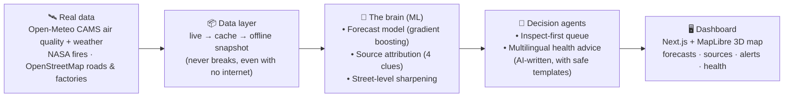

<div align="center">

# 🌬️ VayuNetra — *The eye on the air*

### Urban Air-Quality Intelligence for Indian Cities

**See the air your city breathes — then predict it, explain it, and act on it.**

[](https://vayu-netra-urban-air-quality-intell.vercel.app)
&nbsp;
[](https://vayunetra-api.onrender.com/health)

`Next.js` · `FastAPI` · `scikit-learn` · `MapLibre GL` · `Open-Meteo (CAMS)` · `Groq LLM`

*Built for the **ET AI Hackathon 2.0 — Problem Statement #5** · Smart Cities · Environmental Intelligence · Geospatial · Public Health*

</div>

---

## 🔗 Try it right now

| | Link |
|---|---|
| 🖥️ **Live dashboard** (this is the product) | **https://vayu-netra-urban-air-quality-intell.vercel.app** |
| ⚙️ Backend API | https://vayunetra-api.onrender.com |

> ⏳ **Note:** the backend sleeps when nobody is using it (free hosting). The **first** page load may take ~30–40 seconds while it wakes up. After that it's fast. Just give it a moment.


---

## 🧠 The problem, in one line

> Indian cities already have hundreds of air-quality sensors. **But a sensor only tells you the air is bad *right now*. It doesn't tell you what will happen next, *why* it's bad, or *what to do about it*.**

Most dashboards just show you a number and a colour. That's where they stop.

**VayuNetra goes four steps further.**

---

## ✨ What VayuNetra does — *Monitor → Predict → Attribute → Act*

```
   1. MONITOR            2. PREDICT             3. ATTRIBUTE            4. ACT
   ─────────            ──────────             ───────────            ──────
   "How bad is          "How bad will it       "WHAT is making        "So what do
    the air now?"        be tomorrow?"          it bad?"               we do?"

   Live AQI for         72-hour forecast       Cars? Factories?       • Tell officials WHICH
   every ward,          per ward, with         Dust? Crop fires?        area to inspect first
   street by street     uncertainty bands      — with a confidence    • Warn citizens in their
                                                 score + evidence        own language
```

| Step | In plain words | The clever bit |
|---|---|---|
| **1. Monitor** 📡 | Show the live air quality (AQI) for every neighbourhood (ward) of a city. | We sharpen a coarse map into a **street-level** one using roads + factory locations, so you see pollution block-by-block — not one number for the whole city. |
| **2. Predict** 🔮 | Show what the air will be like for the next **72 hours**. | A machine-learning model that is **27–50% more accurate** than the usual "tomorrow will be like today" guess (the standard baseline). It comes with an honest "we might be off by this much" band. |
| **3. Attribute** 🔍 | Explain **what is causing** the bad air — traffic, industry, dust, or biomass/crop burning. | It mixes four independent clues (chemistry, particle size, upwind fires, weather) and gives a **confidence score + an evidence trail**, so it's not a black box. |
| **4. Act** 🚦 | Turn all of that into **decisions**. | A ranked **"inspect this first" list** for officials, and **multilingual health advice** for citizens (e.g. Hindi, Tamil, Bengali) that changes with the live air. |

---

## 🎬 See it in action

**The command centre** — a live 3D map of pollution, station markers, time-travel slider (Now → +72h), and a side panel that explains everything.


**Did we get the forecast right? (The honesty page)** — we show our own report card: how close our predictions were to reality, on data the model had never seen.


**What is the air doing to people?** — pollution translated into "cigarettes a day", excess health risk, and personal advice that changes for a child, an elderly person, or a pregnant woman *based on the live AQI*.


---

## 🤔 Why is this different (and why should a judge care)?

1. **It predicts, it doesn't just report.** Anyone can show today's number. We tell you tomorrow's — and we *prove* our forecast is better than the baseline on a fair test.
2. **It explains the "why".** Knowing the air is bad is useless if you don't know whether to fix traffic or shut a factory. We point at the cause.
3. **It's honest.** When we model something (e.g. fire data when the live feed is down), we **say so on screen**. We never pretend an estimate is a measurement.
4. **It turns data into action.** A ranked inspection list for the government + plain-language health warnings for people. That's the whole point — *data that does something*.
5. **It's real and live.** Powered by real Open-Meteo (CAMS) satellite air-quality data that updates every hour. Switch cities and watch the numbers, wind, sources and advice all change together.

---

## 🏗️ How it works (the simple version)



**In words:** we pull in **real air + weather data**, keep a safe offline copy so the app never dies, run it through a **machine-learning brain** that forecasts and explains the pollution, hand the results to **AI agents** that write the advice and the inspection list, and show all of it on a **live map dashboard**.

> 🧱 **Why the offline copy matters:** during a live demo on stage, the Wi-Fi always fails. VayuNetra keeps a committed snapshot of real data, so it works perfectly even with no internet — and quietly upgrades to live data when the network is there.

---

## 📊 How do we know the forecast is actually good?

We don't just *claim* it's accurate — we **show the report card** (open the **Validation** page in the app):

- **Skill vs. the baseline:** our forecast's error is **27–50% lower** than the standard "today = tomorrow" guess, at 24h / 48h / 72h ahead.
- **Tested fairly:** measured on a **9,600+ sample hold-out** — data the model never saw during training. (If a model only looks good on data it has already seen, it's cheating. Ours is tested on fresh data.)
- **Honest uncertainty:** every forecast comes with a "we're ~80% confident it lands in this range" band — and we checked that the band is actually right ~80% of the time.
- **Never worse than the baseline:** the model is mathematically blended with the simple baseline, so it *provably* can't do worse than it.

---

## 🧰 Built with

| Part | Tools |
|---|---|
| **Frontend (the dashboard)** | Next.js · TypeScript · MapLibre GL (3D maps) · MapTiler (satellite) · Recharts · Tailwind CSS |
| **Backend (the brain + API)** | FastAPI · Python 3.12 · scikit-learn (`HistGradientBoostingRegressor`) · pandas |
| **AI agents** | Groq LLM (fast, OpenAI-compatible) — with safe template fallback so it never breaks |
| **Real data** | Open-Meteo / CAMS (air + weather, keyless) · NASA FIRMS (fires) · OpenStreetMap (roads, industry) |
| **Hosting** | Vercel (frontend) · Render (backend) |

---

## 🗺️ What's inside the app

- **Command Centre** — live 3D AQI map, station markers, Now→+72h time slider, wind animation, source mix
- **Forecast** — per-ward 72-hour prediction with uncertainty bands
- **Trends** — last 7 days + the daily rhythm of pollution (when it peaks)
- **Attribution & Enforcement** — what's causing it + a ranked inspection queue
- **Exposure & Health** — cigarettes/day, health risk, and personal advice per group
- **Advisories** — multilingual citizen health guidance
- **Validation** — the model's honest report card
- **National Compare** — all 6 cities side by side
- **Printable Brief** — a one-page "why is the air bad today" report you can save as PDF

*Cities covered: **Delhi · Mumbai · Bengaluru · Kolkata · Chennai · Hyderabad.***

---

## 💻 Run it on your own machine (optional)

You don't need to — **just use the [live app](https://vayu-netra-urban-air-quality-intell.vercel.app)**. But if you want to run it locally:

<details>
<summary><b>Click for local setup steps</b></summary>

**Backend** (Python 3.12+):
```bash
python -m venv backend/.venv
backend/.venv/Scripts/python -m pip install -r backend/requirements.txt
backend/.venv/Scripts/python -m uvicorn app.main:app --app-dir backend --port 8000
```

**Frontend** (Node 20+), in a second terminal:
```bash
cd frontend
npm install
npm run start   # or: npm run dev
```

Then open **http://localhost:3000**.

**Keys are optional.** With no API keys, VayuNetra still runs fully on real cached data + safe templates. To enable live AI advice, copy `backend/.env.example` → `backend/.env` and add a free [Groq key](https://console.groq.com/keys).

</details>

---

## 📁 Project structure

```
backend/    The brain + API (FastAPI, ML models, attribution, AI agents)
frontend/   The dashboard (Next.js + MapLibre)
data/       Real committed snapshots (so the demo works offline)
docs/       Architecture notes, demo script, screenshots
```

---

<div align="center">

**VayuNetra · वायु नेत्र** — *Monitor → Predict → Attribute → Act*

Made for cleaner air in Indian cities. 🇮🇳

</div>
