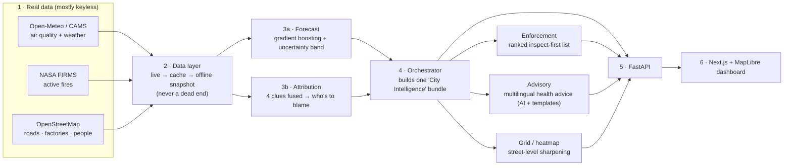

# VayuNetra — How it's built (Architecture)

> *Monitor → Predict → Attribute → Act.* This page explains the system in plain language, with enough depth for an engineer. If you just want to **use** it, open the [live app](https://vayu-netra-urban-air-quality-intell.vercel.app).

---

## 1. The big picture

VayuNetra takes **real air + weather data**, runs it through a **machine-learning brain** that forecasts and explains the pollution, hands the result to **AI agents** that write the advice and the inspection list, and shows everything on a **live map dashboard**.

---

## 2. Where the data comes from (all real, mostly free)

| Source | What it gives us | Key needed? |
|---|---|---|
| **Open-Meteo Air Quality** (CAMS) | PM2.5 / PM10 / NO₂ / SO₂ / O₃ / CO — past **and** forecast | No |
| **Open-Meteo Weather** | wind, temperature, humidity, rain, and **boundary-layer height** (how "tall" the air is — key for pollution) | No |
| **NASA FIRMS** | satellite-detected active fires (upwind crop/biomass burning) | Free key (a seasonal model is used if absent — and we say so) |
| **OpenStreetMap** | roads, industrial areas, population, schools/hospitals | No |

**The safety net:** every live pull falls back to **committed offline snapshots** of *real* data (`data/snapshots/*.json.gz`). So the app works even with **zero internet** — perfect for a live demo where the Wi-Fi always dies — and quietly upgrades to live data when the network is there.

---

## 3. The brain (machine learning)

### 3a. Forecast — "how bad will it be?"
- A single pooled **`HistGradientBoostingRegressor`** predicts PM2.5 from **1 to 120 hours** ahead.
- It learns from: recent PM2.5 history, the **weather forecast at the target hour**, time-of-day/day patterns, and location.
- It is **blended with a simple "today-repeats" baseline** using a weight tuned on held-out data — so it **provably can never do worse** than that baseline.
- Every prediction comes with a **p10–p90 uncertainty band** (a calibrated "we're ~80% sure it lands here" range).

**How good is it?** Measured on a clean **temporal hold-out** (data the model never trained on), it beats the baseline by **+27% to +50%** on error (RMSE) at 24/48/72h. The model's strongest signal is **boundary-layer height** — which is exactly the right physical driver, so the model is learning real science, not noise.

### 3b. Attribution — "what's causing it?"
A single sensor can't tell you the *source*. So we fuse **four independent clues** into a confidence-scored breakdown:

1. **Chemistry fingerprint** — high NO₂/CO points to **traffic**; high SO₂ points to **industry**.
2. **Particle size ratio** — a high PM10:PM2.5 ratio points to **dust / construction**.
3. **Upwind fires** — NASA fires sitting *upwind* (wind back-trajectory) point to **biomass / crop burning**.
4. **Weather dispersion** — low wind + low boundary layer **traps** local pollution.

The output is *"this ward is ~55% dust, 30% traffic, …"* — **with a confidence score and a visible evidence trail**. It's an honest, calibrated *fingerprint*, **not** a full chemical-transport model, and we label it as such.

---

## 4. The decision agents (turning data into action)

- **Enforcement** — deliberately **rule-based and auditable** (not a black box). Ranks wards by `severity × forecast-trend × how-fixable-the-source-is × people-affected`, and maps the top source to a concrete action ("deploy water sprinklers", "PUC checks on the corridor").
- **Advisory** — writes **citizen health advice in the local language** (Hindi, Tamil, Bengali, …) using the **Groq LLM**, with reliable **templates as a fallback**. It runs fine with **no API key**.

Both are assembled by an **orchestrator** into one cached `CityIntelligence` bundle per city.

---

## 5. Making it fast and always-live (system design)

- **Live by default** with a **stale-while-revalidate** cache: the API answers **instantly** from memory and refreshes from the live feed **in the background** — so a user never waits for a network call.
- **One call per city, not 24:** live data for all of a city's wards is fetched in a **single multi-coordinate request** (≈2s instead of ≈80s).
- **HTTP caching:** responses carry `Cache-Control` (short max-age + stale-while-revalidate) so browsers/CDN serve repeats instantly.
- **Resilient LLM:** multiple Groq keys are **rotated** (fail-over on rate limits) behind a **circuit breaker**, so a flaky AI service never slows the app — it just falls back to templates.

---

## 6. Tech stack

- **Backend:** FastAPI · Python 3.12 · scikit-learn · pandas/numpy · httpx
- **Frontend:** Next.js 15 · TypeScript · Tailwind · MapLibre GL (3D maps) · MapTiler (satellite) · Recharts
- **AI:** Groq (OpenAI-compatible) · deterministic template fallback
- **Hosting:** Vercel (frontend) · Render (backend)

---

## 7. How it scales

Adding a new city = **one entry** in `domain/cities.py` (real station coordinates) + a snapshot pull. The exact same pipeline serves any of India's **900+ CAAQMS stations** — no code changes per city.
