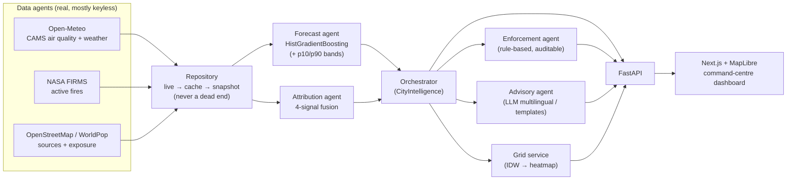

# VayuNetra — Architecture

> Urban Air Quality Intelligence · *Monitor → Predict → Attribute → Act*

## 1. System overview

VayuNetra is a multi-agent platform that fuses real air-quality, weather and fire data into a
single predictive + prescriptive layer for city authorities. It does four things a dashboard
cannot: **predicts** ward-level PM2.5, **attributes** it to its real sources, **prioritises**
enforcement, and **advises** citizens in their own language.

## 2. Data sources (real, free)

| Source | Provides | Key needed |
|---|---|---|
| **Open-Meteo Air Quality** (CAMS) | PM2.5/PM10/NO₂/SO₂/O₃/CO, history + forecast | No |
| **Open-Meteo Weather** | wind, temp, humidity, precip, **boundary-layer height** | No |
| **NASA FIRMS** | VIIRS active fires (upwind biomass) | Free MAP_KEY (else seasonal model) |
| **OpenStreetMap / WorldPop** | industrial/road/construction proxies, population, schools/hospitals | No |

All pulls degrade to **committed offline snapshots** (`data/snapshots/*.json.gz`, real data) so
the demo never depends on a live network.

## 3. The four agents

1. **Forecast** — pooled `HistGradientBoostingRegressor` predicts PM2.5 at +1…120 h from PM2.5
   lags, the *weather forecast at target time*, cyclic temporal features and location. Quantile
   models give p10/p90 bands. Evaluated on a temporal hold-out against the **diurnal-persistence
   baseline** (RMSE).
2. **Attribution** — fuses four independent signals into a confidence-scored PM2.5 apportionment:
   chemistry fingerprint (NO₂/CO→traffic, SO₂→industry), PM10:PM2.5 coarse ratio→dust, upwind
   FIRMS fires (wind-aligned back-trajectory)→biomass, and meteorological dispersion (wind/BLH).
3. **Enforcement** — deliberately rule-based (auditable): ranks zones by severity × forecast trend
   × source actionability × population exposure, and maps the dominant source to a concrete action.
4. **Advisory** — LLM-written native-script advisories per city language (Claude) with reliable
   English + Hindi templates as fallback. **Runs with no API key.**

## 4. Evaluation methodology (honest)

- **Forecast**: temporal train/test split; report RMSE & MAE vs diurnal persistence per horizon.
  Result on snapshot data: **Delhi +34/33/27 %** and **Bengaluru +50/52/47 %** at +24/48/72 h.
- **Attribution**: a calibrated rule-based fingerprint, **not** a chemical-transport model — stated
  as such. Validate against known episodes; confidence scores are surfaced, never hidden.
- **Provenance**: fire-driven biomass contribution is flagged `fires_modeled` when FIRMS runs
  without a key, with an inline tag in the evidence chain.

## 5. Tech stack

- **Backend**: FastAPI · scikit-learn · pandas/numpy · httpx (Python 3.12+, verified on 3.14)
- **Frontend**: Next.js 15 · TypeScript · Tailwind · MapLibre GL · Recharts
- **Agents/LLM**: Anthropic Claude (optional; deterministic fallback)
- **Run**: GitHub Codespaces (`.devcontainer`) or local

## 6. Scaling path

Adding a city = one entry in `domain/cities.py` (real station coordinates) + a snapshot pull.
The same pipeline serves any of India's 900+ CAAQMS stations. Hyperlocal realism beyond CAMS's
~10 km grid is the next step via land-use-regression downscaling (noted in code).
